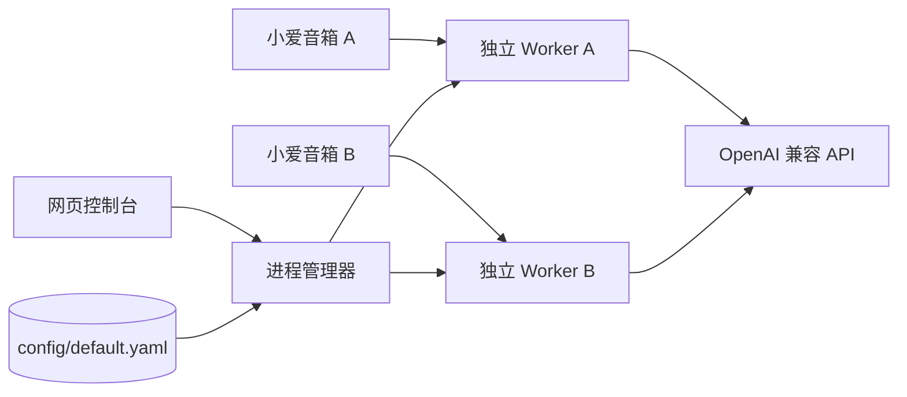

<div align="center">


[](https://github.com/clawpai/mi-paiai/actions/workflows/docker.yml)
[](https://github.com/clawpai/mi-paiai/pkgs/container/mi-paiai)
[](./LICENSE)
[](https://nodejs.org/)

[快速安装](#-快速开始) · [完整安装教程](./docs/INSTALLATION.md) · [配置教程](./docs/CONFIGURATION.md) · [语音指令](./docs/VOICE_COMMANDS.md) · [安全说明](./docs/SECURITY.md)

</div>

> [!IMPORTANT]
> 这是非官方社区项目，与小米及任何 AI 厂商均无隶属关系。小米接口发生变化时，功能可能暂时失效。不要将管理端口直接暴露到公网。

## ✨ 主要功能

- **多音箱完全隔离**：每台音箱运行在独立子进程和独立工作目录中，小米令牌缓存、对话上下文、模型和思考等级互不串线。
- **天蓝色网页控制台**：概览、音箱管理、AI 服务、对话行为、TTS、实时日志分区清晰，桌面与手机均可使用。
- **配置保存即生效**：运行中保存配置会热重载音箱进程，不需要重启 Docker 容器。
- **智能日志跟随**：日志按时间顺序展示，最新内容始终在底部；手动上滚时自动暂停，点击“回到最新”继续跟随。
- **模型目录与语音排序**：单击选择当前模型；Ctrl / ⌘ 多选，手机可开启“多选排序”；模型序号可通过语音切换。
- **丰富的 AI 厂商预设**：OpenAI、DeepSeek、Gemini、Grok、GLM、通义千问、New API、OpenCode、OpenRouter、Ollama 等；同时支持任意 OpenAI 兼容接口。
- **一键读取模型**：调用当前接口的 `/models`，自动合并模型目录。
- **语音切换模型与思考等级**：支持模型名、模糊名称和序号。
- **安全加固**：登录保护、会话限制、CSRF 阻断、密钥脱敏、原子写配置、只读容器、非 root、capabilities 全部丢弃。
- **多架构镜像**：`linux/amd64`、`linux/arm64`、`linux/arm/v7`。

## 🧭 工作方式



每台音箱拥有独立的小米账号、设备匹配、工作目录与运行状态。即使两台音箱同时对话或切换模型，也不会共享会话缓存。

## 🚀 快速开始

### 方式一：Docker Compose（推荐）

```bash
git clone https://github.com/clawpai/mi-paiai.git
cd mi-paiai

mkdir -p data/config data/secrets
printf '%s\n' 'admin' > data/secrets/auth_username
openssl rand -base64 24 > data/secrets/auth_password
openssl rand -base64 48 > data/secrets/auth_secret
chmod 600 data/secrets/*

# 容器默认以 UID/GID 1000 运行
sudo chown -R 1000:1000 data

docker compose up -d
```

打开：

```text
http://你的NAS或服务器IP:36592
```

查看随机生成的面板密码：

```bash
cat data/secrets/auth_password
```

### 方式二：直接运行镜像

```bash
docker run -d \
  --name mi-paiai \
  --restart unless-stopped \
  -p 36592:36592 \
  --read-only \
  --tmpfs /tmp:rw,noexec,nosuid,nodev,size=16m \
  --cap-drop ALL \
  --security-opt no-new-privileges=true \
  --memory 512m \
  --pids-limit 200 \
  -e NODE_ENV=production \
  -e MIPAIAI_CONFIG_DIR=/app/config \
  -e AUTH_USERNAME_FILE=/run/secrets/auth_username \
  -e AUTH_PASSWORD_FILE=/run/secrets/auth_password \
  -e AUTH_SECRET_FILE=/run/secrets/auth_secret \
  -v "$PWD/data/config:/app/config" \
  -v "$PWD/data/secrets:/run/secrets:ro" \
  ghcr.io/clawpai/mi-paiai:latest
```

> 小米 NAS、部分路由器系统或 Docker bridge 无法访问外网时，可改用 `--network host`，并删除 `-p 36592:36592`。不要修改 NAS 的官方 Docker daemon、DNS、路由或防火墙。

## 🛠️ 第一次配置

1. 登录网页控制台。
2. 打开 **AI 服务**：
   - 选择厂商；
   - 填写 API Key；
   - 点击“从上游获取模型”；
   - 排列语音模型序号。
3. 打开 **音箱管理**：
   - 填写小米账号 ID；
   - 填写密码或 PassToken；
   - 填写设备名称；
   - 选择模型、思考等级与语音控制。
4. 多台音箱请使用各自独立的小米账号和设备名称。
5. 点击 **保存配置**。如果服务已经运行，新配置会立即热加载。
6. 点击 **启动服务**。

## 🗣️ 常用语音指令

```text
小爱同学，换模型 2
小爱同学，切换到第三个模型
小爱同学，切换模型 deepseek
小爱同学，当前模型
小爱同学，有哪些模型

小爱同学，切换思考等级 高
小爱同学，开启深度思考
小爱同学，关闭思考
小爱同学，当前思考等级
```

模型名称支持忽略大小写、空格和连字符的模糊匹配。完整说明见 [语音指令教程](./docs/VOICE_COMMANDS.md)。

## 🤖 AI 厂商

控制台内置多组预设：

| 类型 | 示例 |
|---|---|
| 聚合 / 中转 | Sub2API、New API、One API、OpenCode、OpenRouter、AiHubMix |
| 国际主流 | OpenAI、Anthropic、Gemini、Grok、Mistral、Groq、Perplexity、Cohere、Together、NVIDIA NIM |
| 国内主流 | DeepSeek、GLM、通义千问、Kimi、MiniMax、豆包、腾讯混元、硅基流动、魔搭 |
| 本地 / 自建 | Ollama、LM Studio、vLLM、SGLang、Azure OpenAI |
| 其他 | 任意 OpenAI 兼容接口 |

预设地址可能随厂商调整；所有地址都可在控制台中编辑。部分模型不支持 `reasoning_effort`，遇到 HTTP 400 时请把思考等级改为“默认”。

## 🔐 隐私与安全

- 仓库不包含小米账号、PassToken、API Key、面板密码、家庭 IP 或个人 NAS 路径。
- 配置 API 永远不会把已保存的密码、PassToken 和 API Key 返回给浏览器。
- 密钥建议通过 Docker secret 文件挂载，不要写进 Compose、截图、Issue 或日志。
- CI 会运行 `pnpm privacy-check`，阻止常见令牌、凭据 URL 和已知私人标识被提交。
- 默认限制 512 MiB 内存和 200 PIDs；容器只读、非 root、无 Linux capability。

详情见 [安全说明](./docs/SECURITY.md)。

## 📚 文档

- [完整安装教程](./docs/INSTALLATION.md)
- [配置与厂商教程](./docs/CONFIGURATION.md)
- [语音控制教程](./docs/VOICE_COMMANDS.md)
- [安全、隐私与故障排查](./docs/SECURITY.md)
- [贡献指南](./CONTRIBUTING.md)
- [安全策略](./SECURITY.md)
- [上游署名与修改说明](./NOTICE.md)

## 🧪 本地开发

```bash
corepack enable
pnpm install --frozen-lockfile
pnpm privacy-check
pnpm typecheck
pnpm test
pnpm build
```

## 🙏 上游与署名

`mi-paiai` 是一个独立维护的衍生项目：

- 最初的 Web/CLI 单仓结构改自 [`zhuzhu88920/migpt-ultimate`](https://github.com/zhuzhu88920/migpt-ultimate)。
- 该项目及本项目继续基于 [`idootop/migpt-next`](https://github.com/idootop/migpt-next) 和 `@mi-gpt/*` npm 包。
- 详细修改范围、版权和商标说明见 [NOTICE.md](./NOTICE.md)。

感谢所有上游作者和贡献者。

## 📄 许可证

MIT License。详见 [LICENSE](./LICENSE)。